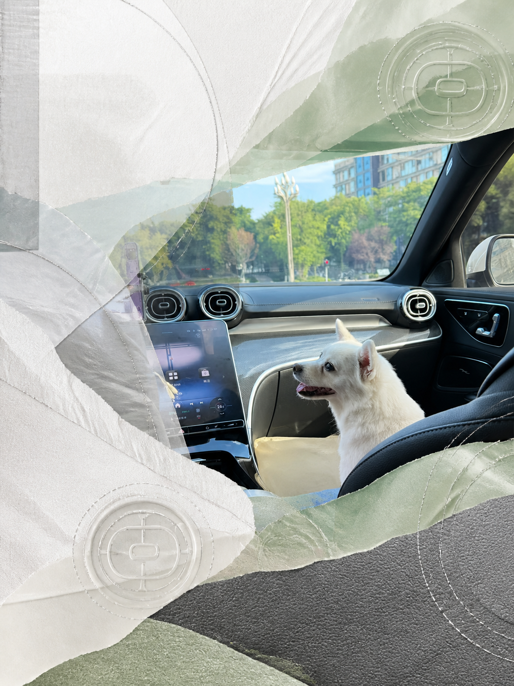
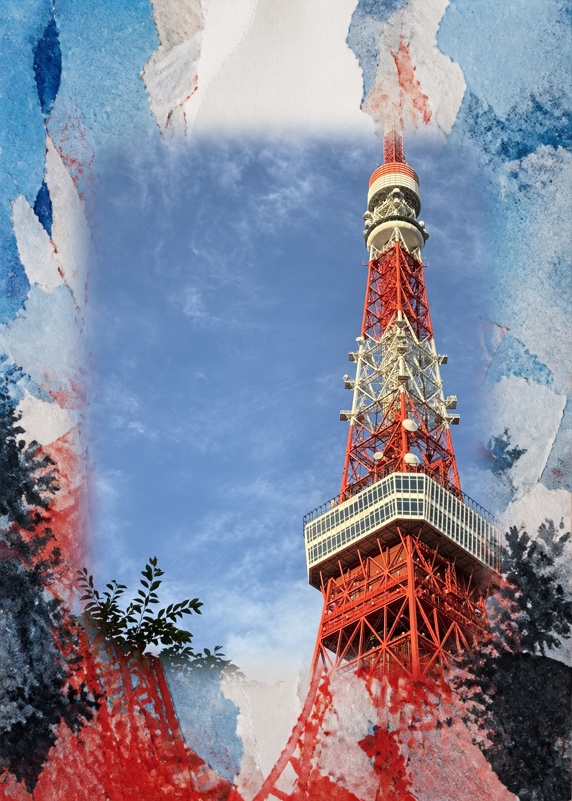

# Photo Alchemy · 凡影成艺

[English](./README.md)

### 从照片未曾言明之处，找到作品。

照片记录的不只是对象，也包含距离、方向、视觉重量、色彩记忆，以及尚未完成表达的关系。

Photo Alchemy 读取这些潜藏结构，并将它们重新组织成原创作品。它不是预设滤镜，不套用固定风格，也不机械描摹原图。原始照片始终是创作判断的依据，而最终作品可以获得属于自己的形式。

*创作与艺术方向 · **少年老程***

## 精选作品

以下六张成图均为 `extend`（扩展）案例。它们不是可重复套用的版式；每一张都从不同的画面关系出发，让真实摄影与重新构造的材料场域相遇。

### 动作与场域

| 转身的动作把周围雪面聚合为压力与方向。 | 微小的人物为开阔雪场建立尺度。 |
| :---: | :---: |
|  |  |

### 通道与包围

| 乘车的白犬成为层叠车厢内部的安静中心。 | 街道、电线、车流与暮色被压缩为一条通道。 |
| :---: | :---: |
|  |  |

### 光与垂直牵引

| 一束狭长的光在浓密绿色中打开停留之处。 | 塔的上升力量继续进入色彩、材料与天空。 |
| :---: | :---: |
|  |  |

这些案例只展示当前的一条创作路径，并不代表 Skill 的视觉边界。`abstraction` 与 `reduction` 使用不同的画面逻辑，不会继承这里展示的拼合语言。

## 当前创作路径

Photo Alchemy 是一个完整的创作系统。不同方法只是进入同一张照片的不同路径，并非固定打包的三张输出。

| 方法 | 成品是否保留照片像素 | 创作目标 |
| --- | --- | --- |
| `abstraction`（抽象） | 否 | 将主导画面的感知事件转化为完整抽象作品；可识别形象可以松开为节奏、压力、间隔、体量与色彩。 |
| `extend`（扩展） | 是 | 保留真实摄影场域，让独立材料语言对其继续延展、重新平衡或建立新框架。 |
| `reduction`（减法） | 否 | 围绕不可替代的源关系重新构造场景，同时释放偶然与冗余的描述信息。 |

`reduction` 只是方法名称，不表示降低分辨率，也不表示把所有视觉层次压缩到最低。

如果没有指定方法，Skill 会根据照片最强的依据进行选择：不可替代的摄影事实倾向 `extend`，主导画面意义的感知事件倾向 `abstraction`，能够在重绘后继续保持特异性的核心关系倾向 `reduction`。

## 从原图到作品

创作过程保持连贯，但不会变成固定模板：

1. **识别关系**：找到真正控制观看方式的主体、距离、方向、重量或张力。
2. **确立意图**：判断什么必须留下、什么可以松开，以及新作品应当让什么更加显现。
3. **重组画面**：选择创作方法，围绕意图重新建立形态、色彩、材料、尺度与安静空间。
4. **完成作品**：检查语义完整性、视觉层级、方法区分度与可见缺陷，只修正确实存在的问题。

内部的场景卡、方法简报、提示词编译器和审阅规则为这套过程提供支持，但不会强制固定比例、纸面处理、标题体系或项目配色。

## 开始创作

### 环境要求

宿主环境需要提供：

- 图片输入与视觉检查能力；
- 支持参考图的位图生成或编辑能力；
- 读取项目内 `references/` 文件的权限；
- 保存并返回生成图片的能力。

图像质量与原图保持能力仍取决于宿主环境可用的模型。

### 安装到 Codex

Windows PowerShell：

```powershell
git clone https://github.com/mingjie914/photo-alchemy.git `
  "$env:USERPROFILE\.codex\skills\photo-alchemy"
```

macOS 或 Linux：

```bash
git clone https://github.com/mingjie914/photo-alchemy.git \
  ~/.codex/skills/photo-alchemy
```

安装后新建任务，让 Codex 重新发现该 Skill。

如果同时保留独立开发目录，只在需要测试某一版本时将完整仓库复制到 Skills 目录，不要让两个各自修改过的副本相互合并覆盖。

### 更新

Windows 中的干净 Git 安装可以执行：

```powershell
git -C "$env:USERPROFILE\.codex\skills\photo-alchemy" pull --ff-only
```

macOS 或 Linux：

```bash
git -C ~/.codex/skills/photo-alchemy pull --ff-only
```

如果安装目录已有本地修改，请先比较或保留这些修改，不要直接覆盖。

### 使用

提供一张原始照片并选择一种路径：

```text
$photo-alchemy method=abstraction
$photo-alchemy method=extend
$photo-alchemy method=reduction
```

也可以直接使用自然语言：

```text
使用 $photo-alchemy 将这张照片处理为抽象作品。
使用 $photo-alchemy 扩展这张照片，形成原创材料构图。
使用 $photo-alchemy 对这张照片做减法处理，同时保留它不可替代的关系。
```

在开发测试或横向比较时，可以明确要求全部方法：

```text
$photo-alchemy method=all
```

### 其他 Agent 平台

核心创作流程由可移植的 `SKILL.md` 与相对路径 `references/` 文件承载。兼容 Agent Skills 的平台可以按照自身规则导入整个文件夹或 ZIP 包。`agents/openai.yaml` 是 OpenAI 平台的界面元数据，其他平台可以忽略。

## Skill 会返回什么

每种已选方法返回：

- 一张标明方法的完成位图；
- 一至两句使用用户语言撰写的简短创作说明。

场景卡、方法简报和完整生成提示词默认保持内部，只有用户主动要求时才会提供。除非用户明确提出，生成作品本身不会添加标题、排版文字、署名、来源信息、元数据、水印或推广内容。

## 创作边界

- 先保留关系，再处理表面细节。
- 构图、色彩、节奏和辅助元素必须来自原始照片中的真实依据。
- 不同方法保持独立的画面逻辑与材料语言。
- 不套用固定版式，不复制他人的标志性视觉，不采用默认化的 AI 绘画质感，不硬编码标题，也不添加无功能装饰。
- 每种方法都从原始照片生成，不使用另一种方法的结果作为中间参考。
- 在正常尺寸与缩略图尺寸下检查，只有出现明确问题时才进行至多一次定向修正。

目标不是把每张照片都变得宏大，而是找到那个足以让这张照片成为它自己的关系。

## 创作者

Photo Alchemy 由 **少年老程** 创作并担任艺术方向。它持续探索一种从观看、关系与视觉判断出发，而非从固定风格出发的计算影像创作方式。

## 原图处理

原始照片仅用于用户当前请求的生成任务。除非用户明确要求，Skill 不会主动搜索、公开、写入项目仓库或在其他任务中复用该照片。宿主平台仍可能把图片发送给其配置的图像生成服务，因此相应服务的隐私与数据条款同样适用。

## 非商业使用政策

除非相关权利人另行授权，使用本 Skill 生成的作品仅用于个人、教育、研究与非商业用途。

- 本项目拥有权利的演示图与随项目发布的作品不授予商业使用许可。
- 用户上传照片的权利仍属于相应权利人。
- 用户还必须遵守宿主平台所使用模型或图像生成服务的条款。
- Skill 源码许可证不能覆盖或替代照片版权、隐私权、肖像权、商标权及作品权利。

本项目目前不设置独立的 `LICENSE` 文件。除非相关权利人另行明确授权，本仓库内容不授予商业使用、出售、再许可或商业再分发权限。

## 目录结构

```text
photo-alchemy/
├── README.md
├── README.zh-CN.md
├── SKILL.md
├── agents/
│   └── openai.yaml
├── examples/
│   └── 精选成图案例
└── references/
    ├── branches.md
    ├── prompt-compiler.md
    └── review.md
```

- `SKILL.md`：触发条件、共享流程与方法区分规则。
- `references/branches.md`：各方法独立的创作契约。
- `references/prompt-compiler.md`：共享提示词契约与各方法的材料边界。
- `references/review.md`：质量门槛与定向修正规则。
- `examples/`：用于展示当前行为的项目精选成图。
- `agents/openai.yaml`：OpenAI 平台界面元数据。
